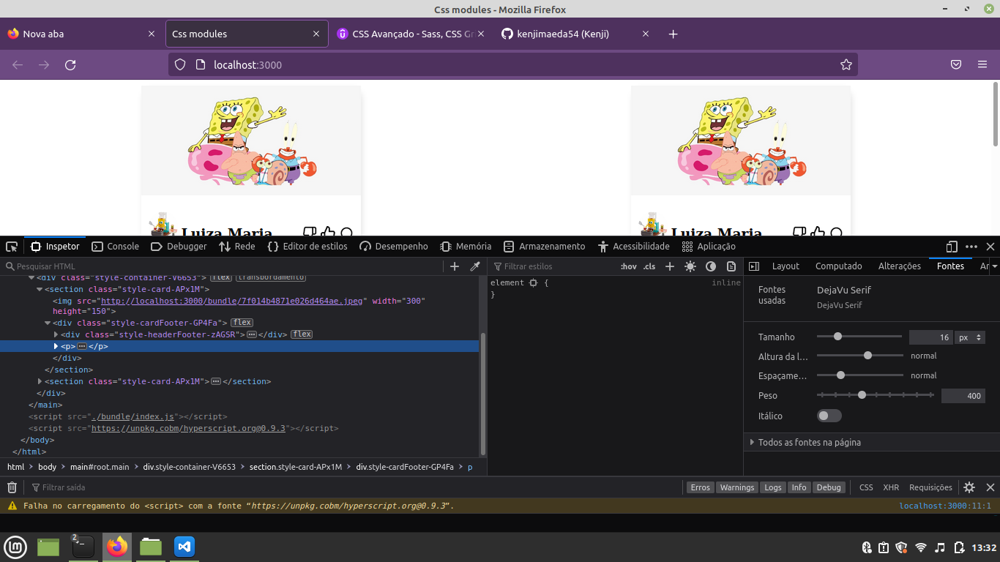

# training-css-modules
Training css modules

# Motivação
Entender css modules e possíveis caso de uso.</br>
Css moduels adiciona hash nas classes para eliminar  problemas de hierarquias nos estilos em Css </br>
Css trabalha em cascate então classes com mesmo nome podem sobrescrever estilos.

# Feature
- Css modules trabalha basicamente em 3 princípios. Arquivos globais,escopo  e compose.
- Global são arquivo disponível em toda aplicação, arquivos globais não  são adicionados as hash nas classes.
- Escopo  são css que possuem as hash em seu escopo.
- Compose e a possiblidade de usar outras classes no escopo, parecido com  .class a 

``` css


:global(.main){
  padding: 0px;
  margin: 0px;
  box-sizing: border-box;
  min-height: 100%;
}
```

``` javascript

import global from './global/format.css';
const app = document.querySelector('#root');
app.appendChild(Home);
app.classList.add("main");


```


